# A Retrieval-Augmented GenAI Slackbot in LlamaIndex

In this repo we're going to walk you through the process of building and deploying a Slackbot that listens to your conversations, learns from them, and uses that knowledge to answer questions about what's going on in your Slack workspace.

## Things you'll need to start

* Rudimentary understanding of LlamaIndex. If you haven't got that, the [starter tutorial](https://docs.llamaindex.ai/en/stable/getting_started/starter_example.html) in our documentation will give you as much as you need to understand this tutorial and takes only a few minutes.
* A working knowledge of Python, and Python 3.11 or higher installed
* A Slack workspace you can install apps to (so you'll need to be an admin)
* A clone of this repo on your local machine

## Step 1: Create a Slack app, and install it to your workspace

This is the most complicated step, because Slack is very picky about permissions.

The very first version of your Slackbot is going to be only about 20 lines of code. All it does is provide a "challenge" endpoint that Slack needs to verify your app is available. You can see this code as the file `1_flask.py` in the repo. Let's walk through it.

First we bring in your dependencies. You'll need to install these with pip or poetry if you don't have them already. 

```python
from flask import Flask, request, jsonify
```

Now we'll create your flask app and set it up so it can run in development.

```python
flask_app = Flask(__name__)

if __name__ == "__main__":
    flask_app.run(port=3000)
```

Between those lines we'll add our basic route: if a POST request is received that contains a JSON object with a `challenge` key, we'll return the value of that key. Otherwise we'll do nothing.

```python
@flask_app.route("/", methods=["POST"])
def slack_challenge():
    if request.json and "challenge" in request.json:
        print("Received challenge")
        return jsonify({"challenge": request.json["challenge"]})
    else:
        print("Got unknown request incoming")
        print(request.json)
    return
```

### Make your app available to Slack

To configure a Slack app, it needs to be running somewhere Slack can see it. So let's run our Slack app.

```
python 1_flask.py
```

And we'll set it up so the world can see it using [ngrok](https://ngrok.com/). You'll need to download and install ngrok for this step. Once you have it installed, run the following command so it can find our app running on port 3000:

```
ngrok http 3000
```

ngrok will give you an HTTPS url like `https://1bf6-64-38-189-168.ngrok-free.app`. Make a note of it, because we need to give that to Slack. Also keep in mind that if you stop ngrok and start it again, this URL will change and you'll need to tell Slack about that. You'll only need this during development.

### Register your app with Slack

Go to the [Slack API site](https://api.slack.com/apps) and click "Create New App". You'll see a screen like this, you'll want to pick "from scratch":

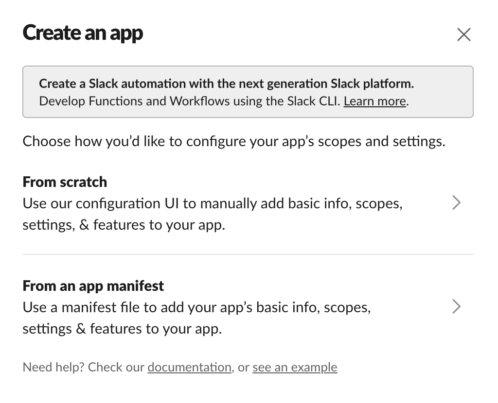

Pick a nice friendly name and the workspace you want to install it to. You'll see a screen like this:

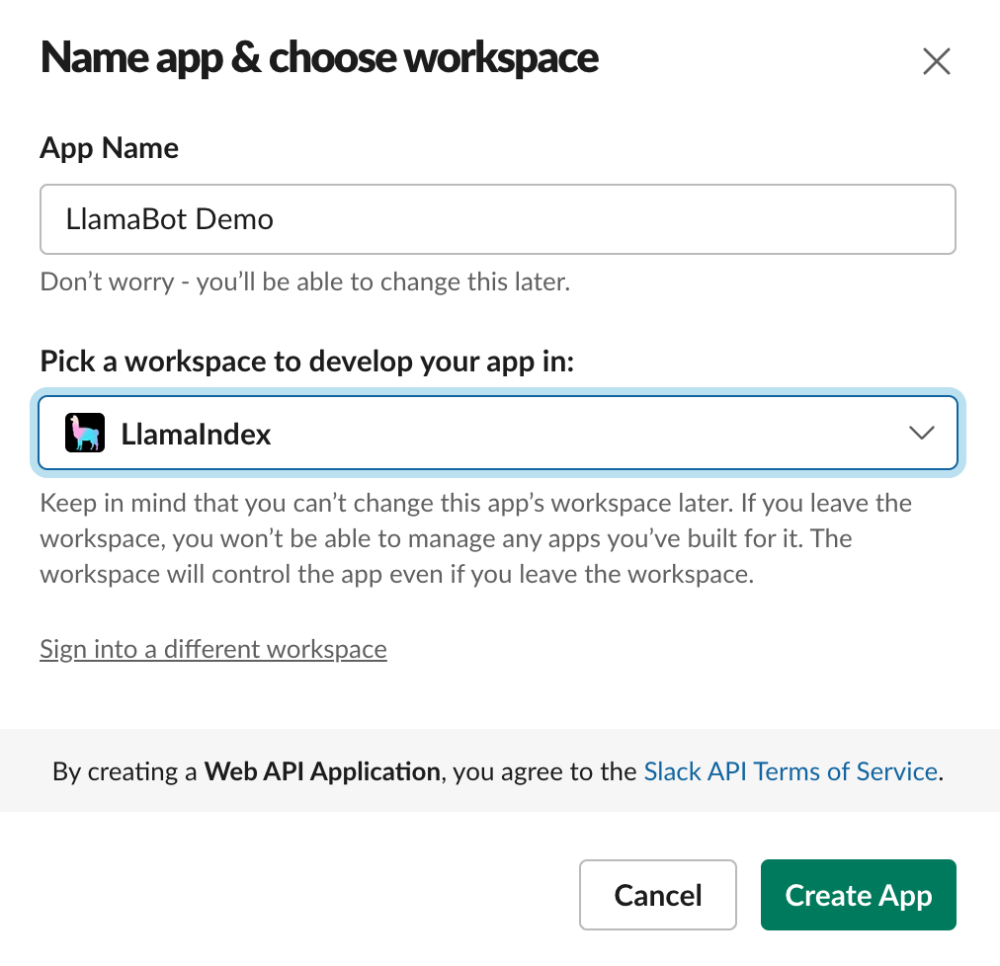

Next you'll want to set up what permissions your app needs. Click the "Permissions" link in the bottom right:

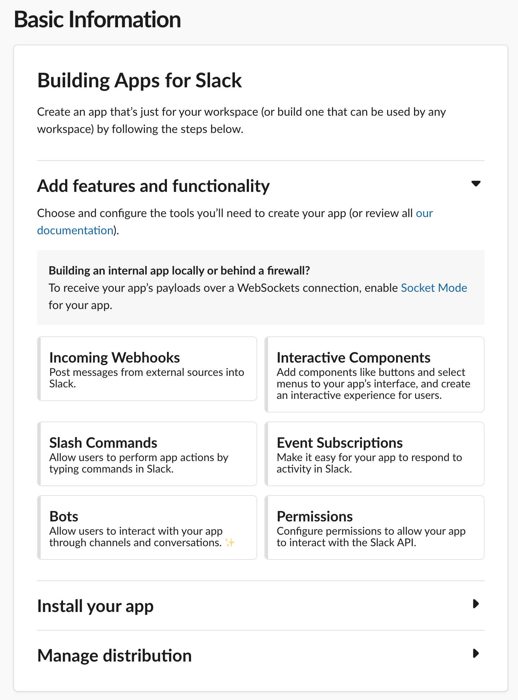

This will bring you to the "scopes" screen where you'll need to add all the scopes you see in this picture, namely:
* channels:read - the lets your app see what channels are avaialble
* channels:join - this lets your app join channels
* channels:history - this lets your app see previous messages in channels
* chat:write - this lets your app send messages
* users:read - this lets your app see people's names

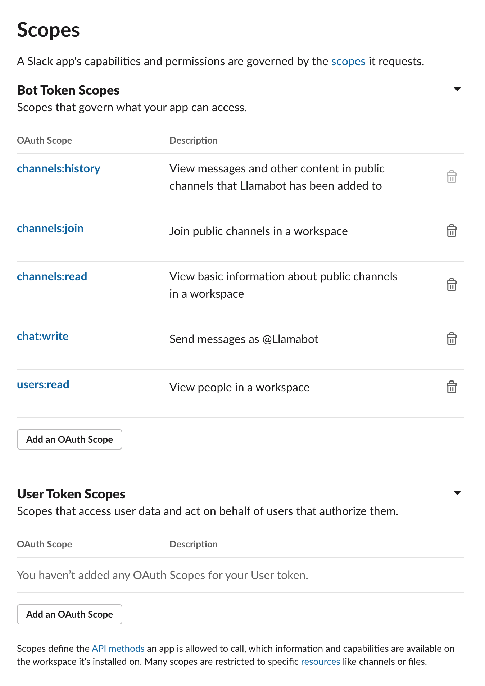

Once you've saved those scopes, scroll up to "Install to workspace" to install your app.

You now need to tell Slack where your app is so you can receive messages from it. Click the "Event Subscriptions" link in the left nav and fill it out so it looks something like this, specifically:
* Set your Request URL to that URL that ngrok gave you earlier
* Subscribe to the `message.channels` event

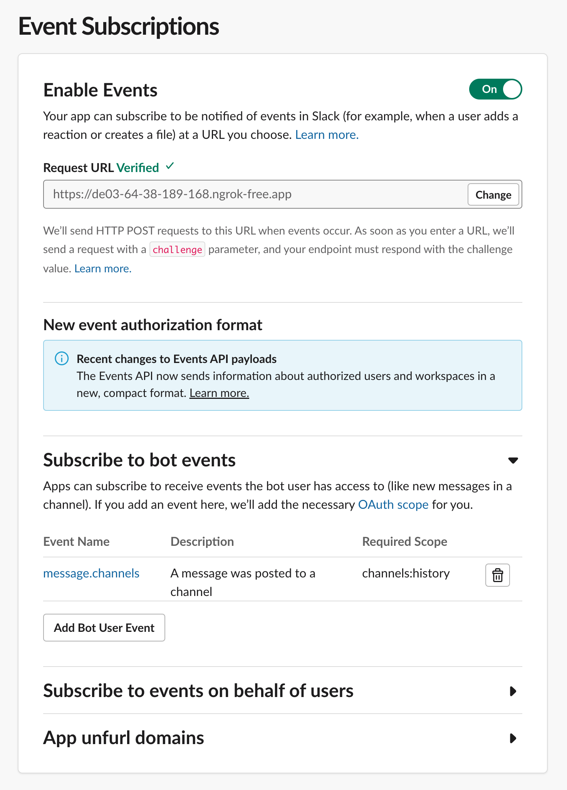

If your app is running and ngrok is correctly tunneling, your Request URL should be Verified.

Phew! That was a lot. Your Slack app is now registered and Slack will send it messages. But to get those messages, you have to tell it to join a channel.

## Step 2: Join a channel, and reply to messages

To do this we'll need to extend our app. You can see the final result of this step in `2_join_and_reply.py`. Let's walk through what we've added:

```python
import dotenv, os
dotenv.load_dotenv()
```

We need some environment variables, so you'll need to add these lines and install `python-dotenv`. You'll also need to create a `.env` file in the root of your project with three values:

* `OPENAI_API_KEY`: your OpenAI API key. You don't need this quite yet but you may as well [get it now](https://platform.openai.com/).
* `SLACK_BOT_TOKEN`: you can find this in the "OAuth and Permissions" section of your Slack app.
* `SLACK_SIGNING_SECRET`: you can find this in the "Basic Information" section of your Slack app.

We're going to use Slack's handy Python SDK to build our app, so pip install `slack-bolt` and then update all our imports:

```python
from slack_bolt import App
from flask import Flask, request, jsonify
from slack_bolt.adapter.flask import SlackRequestHandler
```

Now initialize a Slack Bolt app using those secrets we set just now:

```python
app = App(
    token=os.environ.get("SLACK_BOT_TOKEN"),
    signing_secret=os.environ.get("SLACK_SIGNING_SECRET")
)
handler = SlackRequestHandler(app)
```

To listen to messages, the bot has to be in a channel. You can get it to join any and all public channels, but for the purposes of testing I've created a channel called `#bot-testing` and that's the one it's joining here:

```python
channel_list = app.client.conversations_list().data
channel = next((channel for channel in channel_list.get('channels') if channel.get("name") == "bot-testing"), None)
channel_id = channel.get('id')
app.client.conversations_join(channel=channel_id)
print(f"Found the channel {channel_id} and joined it")
```

`app.client` is the Bolt framework's Slack WebClient, so you can do anything a WebClient can do directly from within the framework. The final addition here is a very simple message listener:

```python
@app.message()
def reply(message, say):
    print(message)
    say("Yes?")
```

In the Bolt framework, the `@app.message` decorator tells the framework to trigger this method when it receives a message event. The `say` parameter is a function that will send a message back to the channel the message came from. So this code will send a message back to the channel saying "Yes?" every time it receives a message.

Let's try it out! Stop running `1_flask.py` and run `python 2_join_and_reply.py` instead. You don't need to restart `ngrok`, it will continue to send messages to port 3000 as before. Here's me trying it out:

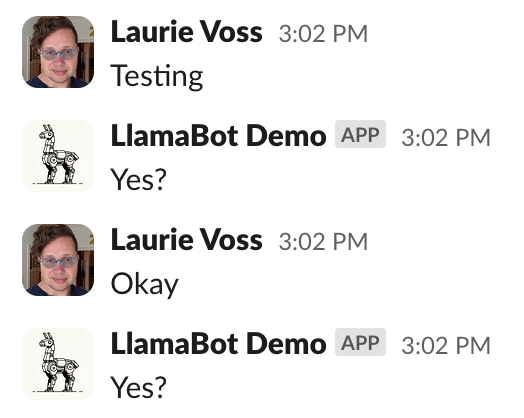

Success! We have a very annoying bot that replies to every single thing anybody says. We can do better!

## Step 3: reply only to messages that mention the bot

This is a pretty simple change on the surface, but Slack's incoming message format is a little complicated so we have to add a fair bit of code. You can see the final results in `3_reply_to_mentions.py`.

First, to tell when our bot is being mentioned, we need our bot's User ID. Under the hood, Slack doesn't use user names or even @-handles, but a globally unique ID across all Slack installations. We have to get that:

```python
auth_response = app.client.auth_test()
bot_user_id = auth_response["user_id"]
```

Now we add an annoyingly complicated chunk of code that parses through Slack's message object to see what user is mentioned in an incoming message. If it's the bot, the bot replies, otherwise it just ignores the message. As we go further, we'll treat messages to the bot as "queries" and any other message as a "fact" for it to store, but we won't be storing it just yet.

```python
@app.message()
def reply(message, say):
    if message.get('blocks'):
        for block in message.get('blocks'):
            if block.get('type') == 'rich_text':
                for rich_text_section in block.get('elements'):
                    for element in rich_text_section.get('elements'):
                        if element.get('type') == 'user' and element.get('user_id') == bot_user_id:
                            for element in rich_text_section.get('elements'):
                                if element.get('type') == 'text':
                                    query = element.get('text')
                                    print(f"Somebody asked the bot: {query}")
                                    say("Yes?")
                                    return
    # otherwise do something else with it
    print("Saw a fact: ", message.get('text'))
```

Oof. That took a while to get right! But now our bot only replies when it's mentioned:

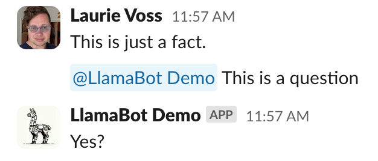

## Step 4: use LlamaIndex to store facts and answer questions

We're all the way at step 4 and we still haven't done anything with LlamaIndex! But now's the time. In `4_incremental_rag.py` you'll see a demonstration of a simple command-line Python script that uses LlamaIndex to store facts and answer questions. I won't walk you through every line (the script has helpful comments for that), but let's look at the important ones. Remember to `pip install llama-index`!

First we create a new `VectorStoreIndex`, an in-memory [vector store](https://docs.llamaindex.ai/en/stable/understanding/indexing/indexing.html#vector-store-index) where we'll be storing our facts. It's empty to start with.

```python
index = VectorStoreIndex([])
```

Next we create 3 `Document` objects and insert them each into our index. Real documents can be huge blocks of text, whole PDFs, even images, but these are just some simple, Slack-message-sized facts.

```python
doc1 = Document(text="Molly is a cat")
doc2 = Document(text="Doug is a dog")
doc3 = Document(text="Carl is a rat")

index.insert(doc1)
index.insert(doc2)
index.insert(doc3)
```

And finally we create a [query engine](https://docs.llamaindex.ai/en/stable/understanding/querying/querying.html) from our index and ask it a question:

```python
# run a query
query_engine = index.as_query_engine()
response = query_engine.query("Who is Molly?")
print(response)
```

The result is "Molly is a cat" plus a whole lot of debugging info because we turned on noisy debugging in `4_incremental_rag.py`. You can see the prompt we sent to the LLM, the context it retrieved from the index, and the response it generated and sent back to us.

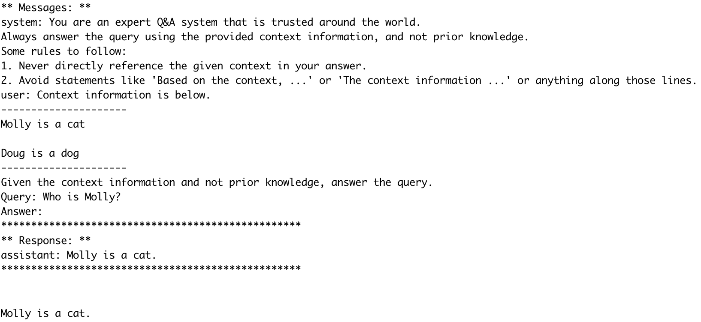

## Step 5: use LlamaIndex to store facts and answer questions in Slack

In `5_rag_in_slack.py` we are combining the two things we had before: script 3, where we reply to queries, and script 4, where we store facts and answer questions. Once again we won't walk through every line, but here are the important changes:

First `pip install llama-index` if you didn't already, and bring in your deps. Initialize your index while you're at it:

```python
from llama_index import VectorStoreIndex, Document

index = VectorStoreIndex([])
```

Where previously we were just replying with "Yes?" (line 73) let's instead send a query to the query engine and reply with the response:

```python
query = element.get('text')
query_engine = index.as_query_engine()
response = query_engine.query(query)
say(str(response))
```

And where previously we were just noting that we'd seen a fact (line 82), let's store it in the index:

```python
index.insert(Document(text=message.get('text')))
```

The result is a Slackbot that can answer questions about what it's been told:


Amazing! You can easily imagine a bot that listens to everybody's conversations and is able to answer questions about things people said weeks or months ago, saving everybody time and effort searching through old messages.

## Step 6: persist our memory

Our bot has a critical flaw though: the index is stored only in memory. If we restart the bot, it forgets everything:

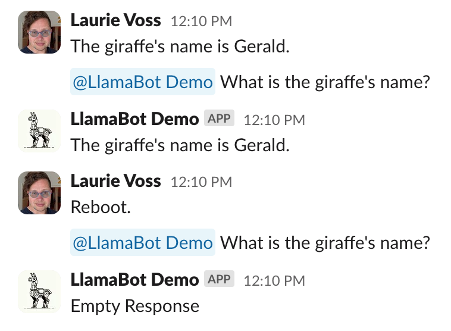

In `6_qdrant.py` we bring in [Qdrant](https://qdrant.tech/), an open-source, local vector database that stores these facts on disk instead. That way if we restart our bot it remembers what was said before. `pip install qdrant-client` and bring in some new deps:

```python
import qdrant_client
from llama_index.vector_stores.qdrant import QdrantVectorStore
```

Now we'll initialize the qdrant client, attach it to a storage context, and give that storage context to our index when we initialize it:

```python
client = qdrant_client.QdrantClient(
    path="./qdrant_data"
)
vector_store = QdrantVectorStore(client=client, collection_name="slack_messages")
storage_context = StorageContext.from_defaults(vector_store=vector_store)

index = VectorStoreIndex([],storage_context=storage_context)
```

That's it for this step! Your bot now survives reboots, and remembers that I typoed "Doug" as "Dough" and was too lazy to fix it for the screenshot:

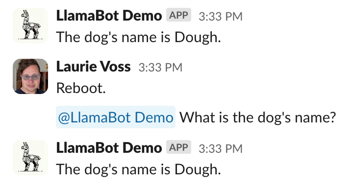

## Step 7: make recent messages more important

We now have a pretty capable bot! But it has a subtle problem: people can say conflicting things, and it doesn't have a way to decide who was "right", such as when I change my mind about what the dog's name should be:

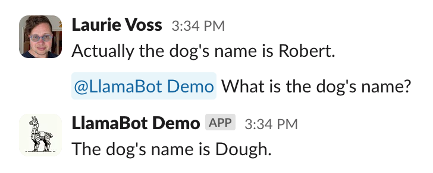

In real Slack conversations, as a situation evolves people might move from saying a project is "in planning" to "underway" to "launched". So we need a way to tell the bot that more recent messages are more important than older ones.

To make this happen we have to do quite a bit of refactoring, the final results of which you can see in `7_recency.py`. First we need a bunch of new deps:

```python
import datetime, uuid
from llama_index.schema import TextNode
from llama_index.prompts import PromptTemplate
from llama_index.postprocessor import FixedRecencyPostprocessor
from llama_index import set_global_handler
```

To make recent messages more important, we have to know when a message was sent. To do that we are going to stop inserting `Documents` into the index and instead insert `Nodes`, to which we're going to attach the timestamp as metadata (under the hood, our Documents were always being converted into Nodes anyway so this doesn't change much):

```python
dt_object = datetime.datetime.fromtimestamp(float(message.get('ts')))
formatted_time = dt_object.strftime('%Y-%m-%d %H:%M:%S')

# get the message text
text = message.get('text')

# create a node with metadata
node = TextNode(
    text=text,
    id_=str(uuid.uuid4()),
    metadata={
        "when": formatted_time
    }
)
index.insert_nodes([node])
```

I've also factored out the reply logic from message handling into its own function, `answer_question`, just to make things a little easier to read. The first thing we're going to change is the prompt that we give to our LLM: we have to tell it that more recent messages are important. To do this we create a prompt template: 

```python
template = (
    "Your context is a series of chat messages. Each one is tagged with 'who:' \n"
    "indicating who was speaking and 'when:' indicating when they said it, \n"
    "followed by a line break and then what they said. There can be up to 20 chat messages.\n"
    "The messages are sorted by recency, so the most recent one is first in the list.\n"
    "The most recent messages should take precedence over older ones.\n"
    "---------------------\n"
    "{context_str}"
    "\n---------------------\n"
    "You are a helpful AI assistant who has been listening to everything everyone has been saying. \n"
    "Given the most relevant chat messages above, please answer this question: {query_str}\n"
)
qa_template = PromptTemplate(template)                                
```

The fun thing about working with LLMs is how often you end up just describing what you're doing in English and that being what you send to the LLM. A prompt template will automatically get the `context_str` and `query_str` from the query engine. But we have to set this template on our query engine, like so:

```python
query_engine.update_prompts(
    {"response_synthesizer:text_qa_template": qa_template}
)
```

Now there's two more things we're going to change. We're going to take the results we get from the vector store and sort them by recency, something LlamaIndex has a built-in class for. It's called the `FixedRecencyPostprocessor`. We tell it the key that holds the timestamp (which we defined earlier on the nodes, above) and how many results it should return:

```python
postprocessor = FixedRecencyPostprocessor(
    top_k=20, 
    date_key="when", # the key in the metadata to find the date
    service_context=ServiceContext.from_defaults()
)
```

Then we need to create our query engine with the postprocessor attached:

```python
query_engine = index.as_query_engine(similarity_top_k=20, node_postprocessors=[postprocessor])
```

While we were at it we did our final thing, which was pass `similarity_top_k=20`, which means the vector store will give us 20 Slack messages as context (the default is just 2, because usually the chunks of text in a Node are a lot bigger).

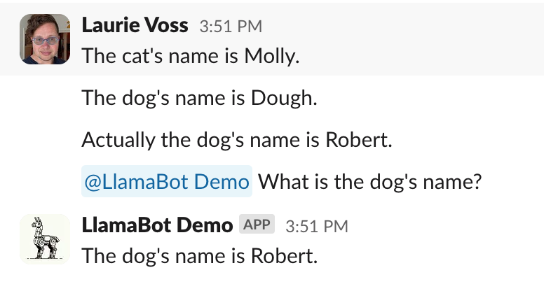

Tada! Now the bot knows to take more recent statements as the truth.

## Step 8: draw the rest of the owl


This bot is working pretty well now, but I was having such fun when building it I got carried away and added two more features:
* I attached metadata about *who* was speaking, not just when, so the bot can answer questions like "What did Logan say about the project?"
* My colleagues interacting with the bot tried to ask follow-up questions in a thread, like we do with each other. So I added a way for the bot to understand that it's in a thread, and treat replies in a thread as follow-up questions, even if the user doesn't mention the bot directly:

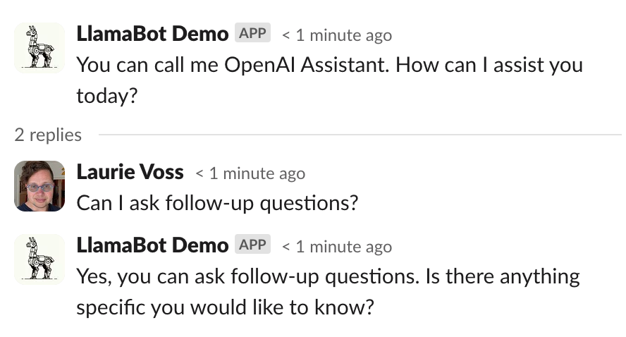

The code to make both of those happen is in `8_rest_of_the_owl.py` but I'm not going to be stepping through it line by line. We have to deploy this thing!

## Step 9: deploy to Render

Until now we've been working with local scripts running through the ngrok tunnel, but even the most dedicated coder turns their laptop off sometimes. Let's put this thing on a real server.

### Login to Render

We'll be deploying to [Render](https://render.com/), a Python-friendly hosting service that's free for small projects. Sign up for an account (I recommend logging in with GitHub)

### Create a new GitHub repository

Render deploys things from GitHub repositories, so you'll need to create a new one and copy 2 files from our existing repo into it:
* `pyproject.toml`
* `8_rest_of_the_owl.py` which we're going to rename to "app.py" for simplicity.

Commit those and push them up to GitHub.

### Create a new Render web service

In Render, create a new web service. Connect it to the repo on GitHub you just created:

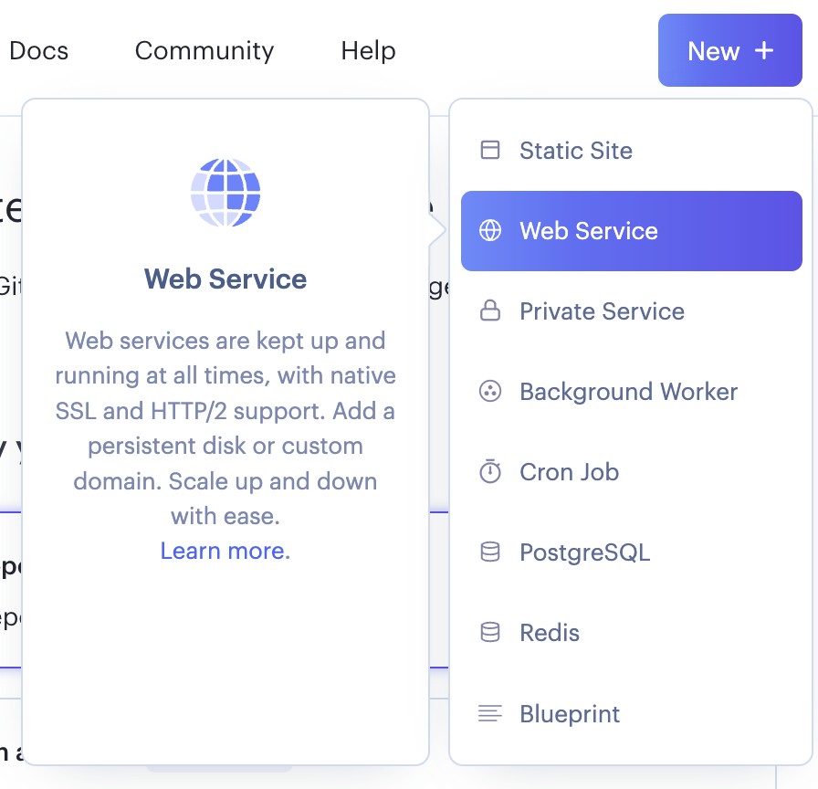

Render will probably automatically detect that this is a Python app but you should make sure the following settings are correct:

* Name: any name you choose
* Region: any region is fine
* Branch: main
* Root directory: (blank, meaning root)
* Runtime: Python 3
* Build command: `poetry install`
* Start command: `gunicorn app:flask_app` (this will definitely need to be set)

You'll also need to scroll down and set some environment variables:

* PYTHON_VERSION: 3.11.6 (or whatever version you're using)
* OPENAI_API_KEY: your OpenAI API key
* SLACK_BOT_TOKEN: your Slack bot token
* SLACK_SIGNING_SECRET: your Slack signing secret from before

Then click deploy and away you go!

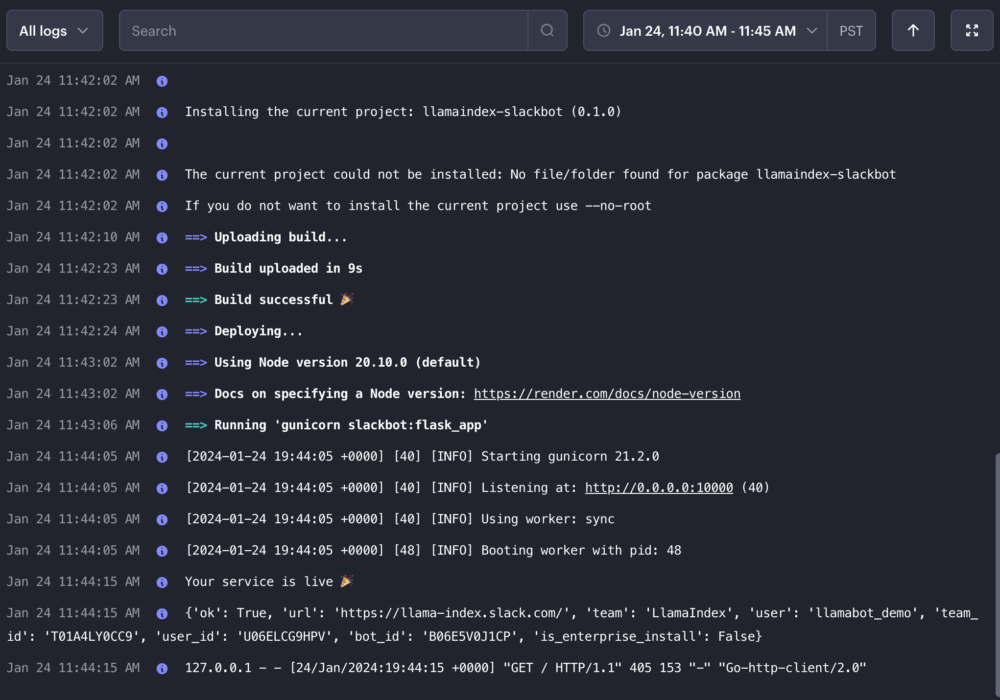

You now have a production Slack bot listening to messages, remembering, learning, and replying. Congratulations!

## What next?

There's a whole bunch of features you could add to this bot, roughly in increasing order of difficulty:

* Join every channel instead of just one, clearly!
* Add a way to tell the bot to forget things (delete nodes)
* Give the bot the ability to use more than one index, such as an index of your documentation, or connected to your email, or your calendar
* Give the bot "tags" so it can attach metadata to nodes and answer questions only with (or ignore) things that have been tagged a certain way
* Add multi-modal abilities, so the bot can read images and even reply with generated images
* And tons more!

This bot is a lot of fun to play with and was a lot of fun to build, I hope you enjoyed learning about Slackbots and LlamaIndex as much as I enjoyed writing this tutorial!
